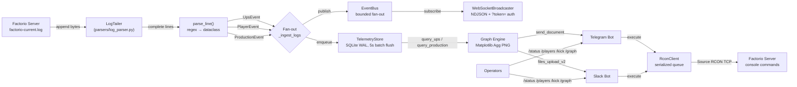

# Factorio Admin Devkit

> Async-first Factorio server administration toolkit: live log telemetry, RCON control, Telegram/Slack bots, WebSocket streaming, and Matplotlib analytics in one Python service.

[](pyproject.toml)
[](https://www.python.org/)
[](LICENSE)
[](https://github.com/FCTostin-team/Factorio-admin-Devkit/actions)
[](tests/)
[](https://docs.python.org/3/library/asyncio.html)
[](main.py)

> [!NOTE]
> This repository previously shipped without a `README.md`. This document was reverse-engineered from the source tree (`main.py`, `config.py`, `settings.py`, `core/`, `parsers/`, `persistence/`, `bots/`, `web/`, `visuals/`, `storage/`, `tests/`, `pyproject.toml`, `config.yaml`) so that every claim below is traceable to real code.

> [!IMPORTANT]
> The service talks to a live Factorio dedicated server over **Source RCON (TCP)** and tails its **live log file**. You need network reachability to the RCON port and filesystem access to `factorio-current.log` before anything else will work.

---

## Table of Contents

- [Factorio Admin Devkit](#factorio-admin-devkit)
- [Table of Contents](#table-of-contents)
- [Features](#features)
- [Tech Stack \& Architecture](#tech-stack--architecture)
  - [Core Stack](#core-stack)
  - [Project Structure](#project-structure)
  - [Key Design Decisions](#key-design-decisions)
  - [Logging \& Telemetry Pipeline](#logging--telemetry-pipeline)
- [Getting Started](#getting-started)
  - [Prerequisites](#prerequisites)
  - [Installation](#installation)
- [Testing](#testing)
- [Deployment](#deployment)
  - [Build the Project](#build-the-project)
  - [Run as a Service](#run-as-a-service)
  - [Containerization](#containerization)
  - [CI/CD Pipeline Integration](#cicd-pipeline-integration)
- [Usage](#usage)
  - [Basic Usage](#basic-usage)
  - [Advanced Usage](#advanced-usage)
- [Configuration](#configuration)
  - [Configuration Sources](#configuration-sources)
  - [Environment Variables](#environment-variables)
  - [YAML Configuration](#yaml-configuration)
- [License](#license)
- [Support the Project](#support-the-project)

---

## Features

Exhaustive capability inventory of the Devkit:

**Log ingestion & parsing**

- 🪵 **Live async log tailer** (`parsers/log_parser.py` → `LogTailer`) that follows `factorio-current.log` without busy-polling, using `asyncio.to_thread` for blocking I/O.
- 🔄 **Rotation/truncation aware** — detects log shrinkage via `stat().st_size` vs. read offset and rewinds to byte `0` automatically.
- 🧪 **Pure-function parsers** — `parse_line(line, *, now=None)` is side-effect-free and fully unit-testable with zero I/O.
- 📊 **Three typed event models** (frozen, slotted dataclasses):
  - `UpsEvent(timestamp, value)` — server ticks-per-second samples (`60.0 UPS`).
  - `PlayerEvent(timestamp, player_name, event_type)` — `[JOIN]` / `[LEAVE]` presence.
  - `ProductionEvent(timestamp, item, count)` — cumulative `item-produced <item> <count>` snapshots.
- 🧵 **Partial-line buffering** — incomplete trailing bytes are held in memory until the terminating `\n` arrives.
- 🧷 **`FileNotFoundError`-tolerant** — if the log file does not exist yet (server not started / mid-rotation), the tailer sleeps and retries instead of crashing.

**RCON control plane**

- 🔌 **Persistent async Source RCON client** (`core/rcon_client.py` → `RconClient`) over a single long-lived TCP connection.
- 📦 **Hand-rolled packet codec** — little-endian `<iii` header (`size`, `packet_id`, `type`) + UTF-8 body + `\x00\x00` terminator, with strict size (`10..4096` bytes) and terminator validation.
- 🚦 **Serialized command queue** — all `execute()` calls flow through one `asyncio.Queue`, so concurrent callers can never interleave packets on the wire.
- 🔁 **Exponential-backoff reconnect** — `1s → 2s → 4s …` capped at `rcon_max_backoff_seconds` (default `60s`), resetting to `1s` on success.
- 🔐 **Correct AUTH handshake** — tolerates the `SERVERDATA_RESPONSE_VALUE`-before-`SERVERDATA_AUTH_RESPONSE` ordering quirk; treats `id == -1` as terminal `RconAuthError` (no pointless retries on bad credentials).
- ⏱️ **Two independent timeouts** — `command_timeout` (per-command response budget) and `connect_timeout` (TCP connect + auth budget).
- 🧰 **Injectable transport factory** — pass `transport_factory: () -> (StreamReader, StreamWriter)` to unit-test the full protocol without touching the network.
- 🧹 **Fail-fast shutdown** — `close()` cancels pending futures with `RconError` so no caller hangs forever.

**Event distribution**

- 📡 **In-process generic pub/sub** (`core/event_bus.py` → `EventBus[T]`) decoupling producers (log tailer) from consumers (persistence, WebSocket).
- 🧺 **Bounded per-subscriber queues** (default `256`) with **drop-oldest backpressure** — slow consumers lose history instead of stalling the producer, preserving real-time semantics.
- 🔌 **Self-unregistering iterators** — `async for event in bus.subscribe()` cleans up on `break`, exception, or cancellation.
- 🔒 **Lock-guarded fan-out** — subscriber-set snapshots are taken under `asyncio.Lock` for task-safe publish/subscribe.

**Persistence & retention**

- 💾 **SQLite-backed telemetry store** (`persistence/db.py` → `TelemetryStore`) on `aiosqlite` with `PRAGMA journal_mode=WAL` for concurrent read/write.
- 🗄️ **Three normalized tables** — `ups_metrics(ts, value)`, `player_events(ts, player, event)`, `production_stats(ts, item, count)` — each with a purpose-built timestamp index.
- 🌊 **Time-driven batched writes** — events are buffered in a `deque` and flushed in a single transaction every `db_flush_interval_seconds` (default `5s`), keeping write amplification near zero under log bursts.
- 🔍 **Time-windowed queries** — `query_ups(since)`, `query_players(since)`, `query_production(since, items=[...])` power every graph and bot command.
- ⚡ **In-memory ring buffer** (`storage/metrics_store.py` → `MetricsStore`) — bounded by both age (default `24h`) and cardinality (default `50,000` points/metric) for hot-path charting without SQLite round-trips.
- 🧪 **Test helper** — `ingest_stream(events)` enqueues and flushes immediately for deterministic integration tests.

**Messenger bots**

- ✈️ **Telegram controller** (`bots/telegram_controller.py`) on `python-telegram-bot v20+`: `/status`, `/players`, `/kick <player> [reason]`, `/graph [ups|production] [hours]`.
- 💬 **Slack controller** (`bots/slack_controller.py`) on `slack-bolt` Socket Mode with the identical slash-command surface (`/status`, `/players`, `/kick`, `/graph`) plus `files_upload_v2` chart uploads.
- 🛡️ **Allow-list auth (Telegram)** — `telegram_allowed_user_ids` rejects unauthorized users with an `Unauthorized.` reply.
- 🚧 **Shared sliding-window rate limiter** — `SlidingWindowRateLimiter(max_events=5, window_seconds=30.0)` per user ID, `asyncio.Lock`-guarded and reused by both bots.
- 🖼️ **In-chat chart delivery** — Telegram sends PNGs via `send_document`; Slack via `files_upload_v2`.
- 🧯 **Graceful RCON error mapping** — `RconTimeoutError` / `RconAuthError` / `RconError` become friendly chat messages, never tracebacks.
- 🧭 **Shared command router** (`bots/command_router.py` → `CommandRouter`) — `shlex`-based dispatch (`status`, `players`, `kick`, `ban`, `say`, `graph`) mapping text commands to RCON actions and telemetry queries.

**Real-time streaming**

- 🌐 **Authenticated WebSocket broadcaster** (`web/ws_server.py`) fanning out every `EventBus` event as newline-delimited JSON (`{"kind": ..., ...}` with ISO-8601 timestamps).
- 🔑 **Pre-handshake shared-secret auth** — `?token=` query parameter enforced in `process_request`; mismatches get HTTP `403 Forbidden` before the WebSocket upgrade completes.
- 🧹 **Dead-client reaping** — send failures trigger `close()` + discard; server shutdown broadcasts close code `1001`.

**Visualization**

- 📈 **UPS line charts** with warning-region shading (`axhspan` below `ups_warning_threshold`), `avg` dashed line, and annotated `min`/`max` scatter markers.
- 📊 **Production stacked-bar charts** bucketed by configurable `bucket_seconds` (default `300s`), one stack segment per item.
- 🧵 **Off-thread rendering** — every chart runs in the default executor via `run_in_executor` (Matplotlib `Agg` backend), so the event loop never blocks on CPU-bound drawing.
- 🪶 **Zero-copy-friendly PNG bytes** — renderers return raw `bytes` ready for Telegram/Slack/HTTP upload.

**Operations**

- 🎛️ **Single-binary orchestration** (`main.py`) — RCON, log ingest, DB flush loop, WebSocket server, and both bots composed under one `asyncio.gather` with `SIGINT`/`SIGTERM` graceful shutdown.
- ⚙️ **Dual configuration system** — `pydantic-settings` + `.env` (`config.py`, used by `main.py`) **and** YAML + env-override dataclasses (`settings.py` + `config.yaml`).
- 📝 **Stdlib logging everywhere** — `logging.getLogger(__name__)` per module; service-task failures are logged with `exc_info` instead of being swallowed.
- 📦 **Console-script entry point** — `factorio-admin = factorio_admin.main:main` declared in `pyproject.toml`.

> [!TIP]
> The fastest way to evaluate the Devkit is: start it against a running Factorio server's log file, connect a WebSocket client with your `?token=`, and watch NDJSON telemetry arrive in real time — no bots required.

---

## Tech Stack & Architecture

### Core Stack

| Layer | Technology | Version constraint | Role |
|---|---|---|---|
| Language | Python | `>=3.11` | `asyncio.timeout`, `TaskGroup`-era idioms, `X \| None` syntax |
| Validation | `pydantic` | `>=2.6` | Strongly-typed `Settings` model |
| Settings | `pydantic-settings` | `>=2.2` | `.env` + environment loading |
| Async SQLite | `aiosqlite` | `>=0.20` | Non-blocking `TelemetryStore` |
| Telegram | `python-telegram-bot` | `>=20.7` | Long-polling bot (`ApplicationBuilder`) |
| Slack | `slack-bolt` | `>=1.18` | Socket Mode async app |
| WebSockets | `websockets` | `>=12.0` | `serve()` + pre-handshake auth hook |
| Charts | `matplotlib` | `>=3.8` | `Agg` backend PNG rendering |
| YAML (alt config) | `PyYAML` | *unpinned* | `settings.py` (`yaml.safe_load`) |
| Tests | `pytest` | `>=8.0` | Unit tests |
| Async tests | `pytest-asyncio` | `>=0.23` | `asyncio_mode = "auto"` |
| Game protocol | Source RCON | hand-rolled | No third-party RCON dependency |

> [!WARNING]
> `settings.py` imports `yaml` (PyYAML), but `pyproject.toml` does not declare it as a dependency. If you use the YAML configuration path, install it explicitly: `pip install pyyaml`. The primary `.env`-based path (`config.py`) does not need it.

> [!CAUTION]
> `bots/command_router.py` uses **flat imports** (`from core.rcon_client import ...`, `from storage.metrics_store import ...`, `from visuals.graph_engine import ...`) and references `visuals.graph_engine.TimeSeries` / `render_timeseries`, which do not exist in the current `graph_engine.py` (it exposes `render_ups_chart` / `render_production_chart`). Treat `command_router.py` as a legacy/WIP module until its imports and graph API are reconciled. All other modules use the `factorio_admin.*` package namespace.

### Project Structure

<details>
<summary><strong>📁 Full file tree (click to expand)</strong></summary>

```text
Factorio-admin-Devkit/                  # Repository root (Python package: factorio_admin)
├── main.py                             # Entry point: service wiring, asyncio.gather, signal handlers
├── config.py                           # Primary config: pydantic-settings Settings + load_settings()
├── settings.py                         # Alt config: YAML dataclasses (Rcon/Telegram/Slack/Settings.from_yaml)
├── config.yaml                         # Sample YAML config (log_path, websocket_*, rcon/telegram/slack)
├── pyproject.toml                      # Build metadata, deps, pytest config, console script
├── __init__.py                         # Package marker: "Factorio administration bot and telemetry service."
├── LICENSE                             # Apache License 2.0
│
├── core/                               # Transport & messaging primitives
│   ├── __init__.py
│   ├── event_bus.py                    # EventBus[T]: generic fan-out pub/sub, bounded queues
│   └── rcon_client.py                  # RconClient: Source RCON, queue-serialized, backoff reconnect
│
├── parsers/                            # Log ingestion
│   ├── __init__.py
│   └── log_parser.py                   # parse_line(), Ups/Player/ProductionEvent, LogTailer
│
├── persistence/                        # Durable storage
│   ├── __init__.py
│   └── db.py                           # TelemetryStore: aiosqlite, WAL, batched flush, windowed queries
│
├── storage/                            # Ephemeral storage
│   ├── __init__.py
│   └── metrics_store.py                # MetricsStore: in-memory TTL+cardinality bounded ring buffer
│
├── bots/                               # Messenger control planes
│   ├── __init__.py
│   ├── command_router.py               # CommandRouter: shlex dispatch → RCON/telemetry (legacy/WIP)
│   ├── telegram_controller.py          # TelegramController + SlidingWindowRateLimiter
│   └── slack_controller.py             # SlackController (Socket Mode, reuses rate limiter)
│
├── web/                                # Streaming API
│   ├── __init__.py
│   └── ws_server.py                    # WebSocketBroadcaster: token-gated NDJSON fan-out
│
├── visuals/                            # Chart rendering
│   ├── __init__.py
│   └── graph_engine.py                 # render_ups_chart(), render_production_chart() (Agg, off-thread)
│
└── tests/                              # Test suite (pytest, asyncio_mode=auto)
    ├── __init__.py
    ├── test_log_parser.py              # Pure-parser tests (UPS/join/leave/production/edge cases)
    └── test_rcon_client.py             # Protocol tests via injected FakeTransport (auth/cmd/timeout)
```

</details>

### Key Design Decisions

1. **Asyncio everywhere, threads only at the edges.** The hot path (`LogTailer.stream` → `EventBus.publish` → `TelemetryStore.enqueue` → `WebSocketBroadcaster`) never blocks the event loop. Blocking work (file reads, Matplotlib rendering) is pushed to threads via `asyncio.to_thread` / `run_in_executor`.
2. **Parse in pure functions, tail in a thin adapter.** `parse_line()` has no I/O, so regex behavior is pinned by cheap unit tests; `LogTailer` only worries about file offsets, buffering, and rotation.
3. **One RCON connection, one writer.** The Source RCON protocol has no multiplexing story worth trusting here, so `RconClient` serializes all commands through a single queue + single `_dispatch`. Concurrency lives in the callers, not on the socket.
4. **Fail loudly on config, degrade gracefully at runtime.** Missing secrets (`rcon_password`, `ws_secret_token`, `log_file_path`) raise at startup via Pydantic validation; transient runtime faults (log file missing, RCON drop, slow WS client) are logged and retried/reaped.
5. **Drop-oldest backpressure.** Both `EventBus` (per-subscriber `256`-slot queues) and `MetricsStore` (TTL + cardinality caps) prefer losing old data over OOMing or stalling producers — the correct trade-off for a live-ops dashboard.
6. **Batch the database.** SQLite writes are amortized into one transaction per flush interval, so a burst of 10k log lines costs ~1 commit, not 10k.
7. **Bots share infrastructure, not code paths.** Telegram and Slack reuse the same `RconClient` instance (serialization for free) and the same `SlidingWindowRateLimiter` class, but register independent handlers so one platform's outage cannot wedge the other.

<details>
<summary><strong>🧩 Deep-dive: service orchestration in <code>main.py</code> (click to expand)</strong></summary>

`main._run(settings)` constructs the dependency graph in dependency order, then fans out:

```text
Settings (load_settings)
  ├─ EventBus[ParsedEvent]
  ├─ TelemetryStore ──open()──► flush_loop() task ......... "db_flush"
  ├─ RconClient ─────────────── run() task ................. "rcon"
  ├─ LogTailer ─┐
  │             └─ _ingest_logs(tailer, bus, store) task ... "log_ingest"
  │                  └─► for each event: store.enqueue + bus.publish
  ├─ WebSocketBroadcaster ───── serve_forever() task ....... "ws_server"
  ├─ TelegramController.start()   (if telegram_enabled)
  └─ SlackController.start()      (if slack_enabled)

Shutdown (SIGINT/SIGTERM or first task completion):
  tailer.stop() → ws.stop() → telegram.stop() → slack.stop()
  → cancel all tasks → gather(return_exceptions=True)
  → rcon.close() → store.close()  (final flush!)
```

> [!NOTE]
> Shutdown order is deliberate: producers stop first (`LogTailer`), then edge servers (`WebSocket`, bots), then transports (`RconClient`), and the database closes **last** so the final `flush()` persists every buffered event.

</details>

### Logging & Telemetry Pipeline

The core data flow — from raw log bytes to dashboards, databases, and chat:



<details>
<summary><strong>🔬 Deep-dive: RCON client lifecycle (Mermaid sequence, click to expand)</strong></summary>

```mermaid
sequenceDiagram
    autonumber
    participant Caller as Command caller
    participant Q as asyncio.Queue
    participant R as RconClient.run()
    participant S as Factorio RCON server

    Caller->>Q: execute("/players online")
    R->>S: TCP connect (connect_timeout)
    R->>S: SERVERDATA_AUTH(password)
    alt tolerant ordering
        S-->>R: SERVERDATA_RESPONSE_VALUE (ignored)
    end
    S-->>R: SERVERDATA_AUTH_RESPONSE (id != -1)
    Note over R: connected.set(); backoff reset to 1s
    R->>Q: get() next _Request
    R->>S: SERVERDATA_EXECCOMMAND("/players online")
    S-->>R: SERVERDATA_RESPONSE_VALUE("...players...")
    R->>Caller: future.set_result(response)
    alt transport lost
        R->>R: log warning; _close_transport()
        R->>R: loop → reconnect with backoff
    else auth rejected (id == -1)
        R->>Q: _fail_all_pending(RconAuthError)
        Note over R: run() returns — operator must fix password
    end
```

**Packet anatomy** (`_Packet.encode`, `_read_packet`):

```text
 0                   1                   2                   3
 0 1 2 3 4 5 6 7 8 9 0 1 2 3 4 5 6 7 8 9 0 1 2 3 4 5 6 7 8 9 0 1
+-+-+-+-+-+-+-+-+-+-+-+-+-+-+-+-+-+-+-+-+-+-+-+-+-+-+-+-+-+-+-+-+
|                         size (int32 LE)                       |
+-+-+-+-+-+-+-+-+-+-+-+-+-+-+-+-+-+-+-+-+-+-+-+-+-+-+-+-+-+-+-+-+
|                      packet id (int32 LE)                     |
+-+-+-+-+-+-+-+-+-+-+-+-+-+-+-+-+-+-+-+-+-+-+-+-+-+-+-+-+-+-+-+-+
|                        type (int32 LE)                        |
+-+-+-+-+-+-+-+-+-+-+-+-+-+-+-+-+-+-+-+-+-+-+-+-+-+-+-+-+-+-+-+-+
|                    UTF-8 body (variable)                     ...
+-+-+-+-+-+-+-+-+-+-+-+-+-+-+-+-+-+-+-+-+-+-+-+-+-+-+-+-+-+-+-+-+
|              0x00             |              0x00             |
+-+-+-+-+-+-+-+-+-+-+-+-+-+-+-+-+-+-+-+-+-+-+-+-+-+-+-+-+-+-+-+-+
  size = 8 + len(body_bytes) + 2        validated: 10 <= size <= 4096
```

</details>

<details>
<summary><strong>🔬 Deep-dive: SQLite schema & indexes (click to expand)</strong></summary>

Applied idempotently by `TelemetryStore.open()` (`CREATE TABLE IF NOT EXISTS` + `PRAGMA journal_mode=WAL`):

```sql
CREATE TABLE IF NOT EXISTS ups_metrics (
    ts    INTEGER NOT NULL,   -- epoch seconds (UTC)
    value REAL    NOT NULL    -- ticks per second
);
CREATE TABLE IF NOT EXISTS player_events (
    ts     INTEGER NOT NULL,
    player TEXT    NOT NULL,
    event  TEXT    NOT NULL    -- 'join' | 'leave'
);
CREATE TABLE IF NOT EXISTS production_stats (
    ts    INTEGER NOT NULL,
    item  TEXT    NOT NULL,    -- e.g. 'iron-plate'
    count INTEGER NOT NULL    -- cumulative counter snapshot
);

CREATE INDEX IF NOT EXISTS idx_ups_ts        ON ups_metrics(ts);
CREATE INDEX IF NOT EXISTS idx_player_ts     ON player_events(ts);
CREATE INDEX IF NOT EXISTS idx_prod_ts_item  ON production_stats(ts, item);
```

> [!TIP]
> Timestamps are stored as **epoch seconds** (`int(ts.timestamp())`), not ISO strings — range scans on `ts >= ?` stay integer-compared and index-friendly. Conversion helpers `_epoch()` / `_from_epoch()` live in `persistence/db.py`.

</details>

---

## Getting Started

### Prerequisites

| Requirement | Minimum | Notes |
|---|---|---|
| Python | `3.11+` | Uses `asyncio.timeout`, `X \| None`, `str.removeprefix`-era stdlib |
| `pip` | `23+` | Or `pipx` / `uv` / `poetry` if you prefer |
| Factorio dedicated server | any with RCON | Enable RCON in `server-settings.json` (`"rcon_port"`, `"rcon_password"`) |
| Log file access | read | Path to `factorio-current.log` (local path or mounted volume) |
| SQLite | bundled | Ships with CPython; WAL mode needs a writable directory |
| (Optional) Telegram bot token | — | From [@BotFather](https://t.me/BotFather); only if `telegram_enabled=true` |
| (Optional) Slack app + bot tokens | — | Socket Mode app with `xoxb-*` + `xapp-*`; only if `slack_enabled=true` |
| (Optional) Docker / Docker Compose | `24+` / `v2` | Only for the containerized deployment path |
| (Optional) PyYAML | any | Only for the YAML config path (`settings.py`); `pip install pyyaml` |

> [!IMPORTANT]
> Factorio's RCON password is **not** optional: `rcon_password` has no default in `config.py`, and `RconClient` treats a wrong password as a terminal `RconAuthError`. Double-check `server-settings.json` before starting the Devkit.

### Installation

```bash
# 1. Clone the repository
git clone https://github.com/FCTostin-team/Factorio-admin-Devkit.git
cd Factorio-admin-Devkit

# 2. Create and activate an isolated environment (recommended)
python3.11 -m venv .venv
source .venv/bin/activate            # Windows: .venv\Scripts\activate

# 3. Install the runtime dependencies
pip install --upgrade pip
pip install -e .                      # editable install (registers `factorio-admin`)

# 4. Install dev/test extras
pip install -e ".[dev]"

# 5. (YAML-path only) install the undeclared YAML dependency
pip install pyyaml

# 6. Configure secrets — copy the example and edit it
cp .env.example .env 2>/dev/null || true   # see Configuration section for full schema
${EDITOR:-nano} .env

# 7. Run the service
python main.py
# — or, after install, via the console script —
factorio-admin
```

> [!NOTE]
> The console script is declared as `factorio-admin = factorio_admin.main:main` in `pyproject.toml`. If your checkout lays modules flat at the repo root (no `factorio_admin/` package directory), prefer `python main.py` until the packaging layout is normalized — see troubleshooting below.

<details>
<summary><strong>🛠️ Troubleshooting & alternative installs (click to expand)</strong></summary>

**A. `ModuleNotFoundError: No module named 'factorio_admin'`**

The source files import each other as `factorio_admin.*` (e.g. `from factorio_admin.core.rcon_client import RconClient`), but some checkouts place the modules flat at the repo root. Fix with one of:

```bash
# Option 1 — run with the repo root on PYTHONPATH and a package shim:
mkdir -p factorio_admin
ln -s ../core ../parsers ../persistence ../bots ../web ../visuals ../storage factorio_admin/ 2>/dev/null || true
cp main.py config.py factorio_admin/
PYTHONPATH=. python -m factorio_admin.main

# Option 2 — install then run from the packaged location (once layout is normalized):
pip install -e .
python -c "import factorio_admin.main; factorio_admin.main.main()"
```

**B. `ModuleNotFoundError: No module named 'yaml'`**

```bash
pip install pyyaml
```

Only required if you use `settings.py` / `config.yaml`. The default `config.py` path does not need it.

**C. `ModuleNotFoundError: No module named 'telegram' | 'slack_bolt' | 'websockets' | 'matplotlib' | 'aiosqlite'`**

You skipped the runtime install. Re-run:

```bash
pip install -e .
# — or explicitly —
pip install "pydantic>=2.6" "pydantic-settings>=2.2" "aiosqlite>=0.20" \
  "python-telegram-bot>=20.7" "slack-bolt>=1.18" "websockets>=12.0" "matplotlib>=3.8"
```

**D. `RCON authentication failed` on first start**

1. Confirm `server-settings.json` on the Factorio host has matching `rcon_port` / `rcon_password`.
2. Confirm `RCON_PASSWORD` in your `.env` matches exactly (no trailing whitespace/quotes).
3. Confirm TCP reachability: `nc -vz 127.0.0.1 27015` (or your `rcon_host`/`rcon_port`).

**E. `Log file truncated; rewinding to start` spam**

Normal during server restarts/log rotation. If it loops forever, your `log_file_path` points at a file another process truncates continuously — verify the path.

**F. Building from source (sdist/wheel)**

```bash
pip install build
python -m build
ls dist/                       # factorio_admin-0.1.0.tar.gz + .whl
pip install dist/factorio_admin-0.1.0-py3-none-any.whl
```

**G. Windows notes**

- Use `python` instead of `python3.11`, and `.venv\Scripts\activate`.
- `SIGINT`/`SIGTERM` handlers degrade gracefully (`NotImplementedError` is caught); use `Ctrl+C` to stop.
- Prefer forward slashes or escaped backslashes in `LOG_FILE_PATH`, e.g. `C:/factorio/factorio-current.log`.

</details>

---

## Testing

The suite uses `pytest` with `pytest-asyncio` in **auto mode** (`asyncio_mode = "auto"` in `pyproject.toml`), so `async def test_...` functions just work — no decorators required (though the RCON tests still carry explicit `@pytest.mark.asyncio` markers).

```bash
# Activate your venv first
source .venv/bin/activate

# 1. Full suite (unit + protocol tests)
pytest -v

# 2. Parser tests only (pure functions, no I/O — milliseconds)
pytest tests/test_log_parser.py -v

# 3. RCON protocol tests only (FakeTransport, no network)
pytest tests/test_rcon_client.py -v

# 4. With coverage (requires pytest-cov)
pip install pytest-cov
pytest --cov=. --cov-report=term-missing -v
```

**What is covered today:**

| Test file | Cases | Technique |
|---|---|---|
| `tests/test_log_parser.py` | UPS line, `[JOIN]`, `[LEAVE]`, `item-produced`, unmatched line → `None`, empty/`\r\n` → `None` | Fixed timestamp (`now=_FIXED_TS`) for determinism |
| `tests/test_rcon_client.py` | Auth + command round-trip (asserts on-the-wire `ptype`/`body`), auth failure → `RconAuthError` + run-loop exit, command timeout → `RconTimeoutError` | Injected `FakeTransport` (`StreamReader` + recording `_Writer`); hand-encoded packets via `struct.pack("<iii", …)` |

<details>
<summary><strong>🧪 Deep-dive: test authoring guide & linters (click to expand)</strong></summary>

**Writing a parser test** — follow the existing table-driven style:

```python
from datetime import datetime, timezone
from factorio_admin.parsers.log_parser import parse_line, UpsEvent

_FIXED_TS = datetime(2026, 5, 13, 12, 0, 0, tzinfo=timezone.utc)

def test_parse_ups_line() -> None:
    event = parse_line("2026-05-13 12:00:00 60.0 UPS", now=_FIXED_TS)
    assert isinstance(event, UpsEvent)
    assert event.value == 60.0
    assert event.timestamp == _FIXED_TS
```

**Writing an RCON test** — feed canned server bytes, assert recorded client bytes:

```python
# See tests/test_rcon_client.py::FakeTransport for the full harness.
transport.feed(_encode_packet(1, SERVERDATA_AUTH_RESPONSE, ""))
transport.feed(_encode_packet(2, SERVERDATA_RESPONSE_VALUE, "pong"))
run_task = asyncio.create_task(client.run())
try:
    assert await client.execute("/ping") == "pong"
finally:
    await client.close()
    await asyncio.gather(run_task, return_exceptions=True)
```

**Recommended linters** (not pinned in `pyproject.toml` — install as needed):

```bash
pip install ruff flake8 mypy
ruff check .            # fast lint
ruff format --check .   # formatting
flake8 --max-line-length=88 .
mypy --strict main.py core/ parsers/ persistence/  # static typing
```

> [!TIP]
> `TelemetryStore.ingest_stream()` exists specifically for tests: enqueue an iterable of events and flush immediately without waiting for the 5-second `flush_loop` tick.

</details>

---

## Deployment

### Build the Project

```bash
# Reproducible wheel build
pip install build
python -m build                    # → dist/factorio_admin-0.1.0-*

# Verify the artifact installs cleanly in a fresh env
python -m venv /tmp/smoke && /tmp/smoke/bin/pip install dist/*.whl
/tmp/smoke/bin/python -c "import factorio_admin.main; print('smoke OK')"
```

> [!NOTE]
> Version is single-sourced from `pyproject.toml` (`[project] version = "0.1.0"`). Bump it there before tagging a release.

### Run as a Service

**systemd unit** (`/etc/systemd/system/factorio-admin.service`):

```ini
[Unit]
Description=Factorio Admin Devkit
After=network.target
Wants=network-online.target

[Service]
Type=simple
User=factorio
WorkingDirectory=/opt/factorio-admin
EnvironmentFile=/opt/factorio-admin/.env
ExecStart=/opt/factorio-admin/.venv/bin/python /opt/factorio-admin/main.py
Restart=on-failure
RestartSec=5
# Graceful shutdown: SIGTERM → asyncio handlers → ordered teardown
KillSignal=SIGTERM
TimeoutStopSec=30

[Install]
WantedBy=multi-user.target
```

```bash
sudo systemctl daemon-reload
sudo systemctl enable --now factorio-admin
sudo journalctl -u factorio-admin -f
```

> [!IMPORTANT]
> `TimeoutStopSec=30` matters: shutdown flushes the SQLite buffer (`store.close()`) and closes RCON/WebSocket/bot connections in order. Killing the process with `SIGKILL` risks losing up to one flush interval (default `5s`) of buffered telemetry.

### Containerization

**`Dockerfile`:**

```dockerfile
FROM python:3.11-slim AS base
ENV PYTHONDONTWRITEBYTECODE=1 PYTHONUNBUFFERED=1
WORKDIR /app

# System deps for matplotlib (Agg needs libfreetype) + healthcheck
RUN apt-get update && apt-get install -y --no-install-recommends \
      libfreetype6 curl \
    && rm -rf /var/lib/apt/lists/*

COPY pyproject.toml ./
RUN pip install --no-cache-dir -e .

COPY . .
# Secrets come from env / mounted .env at runtime — never bake them in.
EXPOSE 8765
HEALTHCHECK --interval=30s --timeout=5s --retries=3 \
  CMD python -c "import socket; socket.create_connection(('127.0.0.1', 8765), 3)" || exit 1
CMD ["python", "main.py"]
```

**`docker-compose.yml`:**

```yaml
services:
  factorio-admin:
    build: .
    container_name: factorio-admin
    restart: unless-stopped
    env_file: .env
    environment:
      LOG_FILE_PATH: /logs/factorio-current.log
      DB_PATH: /data/factorio_metrics.sqlite3
    ports:
      - "8765:8765"           # WebSocket broadcaster
    volumes:
      - /var/log/factorio:/logs:ro     # Factorio log dir (read-only)
      - factorio-data:/data            # SQLite persistence
    stop_grace_period: 30s             # allow ordered asyncio shutdown

volumes:
  factorio-data:
```

```bash
docker compose up -d --build
docker compose logs -f factorio-admin
```

> [!CAUTION]
> Never commit a real `.env` into the image or the repo. Pass secrets via `env_file`, orchestrator secret stores, or runtime `-e` flags. The RCON password and `WS_SECRET_TOKEN` grant full server control and telemetry access respectively.

### CI/CD Pipeline Integration

Example **GitHub Actions** workflow (`.github/workflows/ci.yml`):

```yaml
name: CI
on: [push, pull_request]

jobs:
  test:
    runs-on: ubuntu-latest
    strategy:
      matrix:
        python-version: ["3.11", "3.12"]
    steps:
      - uses: actions/checkout@v4
      - uses: actions/setup-python@v5
        with:
          python-version: ${{ matrix.python-version }}
      - name: Install
        run: |
          pip install --upgrade pip
          pip install -e ".[dev]"
      - name: Lint (ruff)
        run: |
          pip install ruff
          ruff check .
      - name: Test
        run: pytest -v
```

> [!TIP]
> The RCON and parser tests need **no network, no Factorio server, and no credentials** — they run on `FakeTransport` and pure strings. They are safe to execute on every push, in forks, and in sandboxed runners.

---

## Usage

### Basic Usage

**1. Start the full service** (RCON + log ingest + SQLite + WebSocket + bots):

```python
# main.py — this is the production entry point. Equivalent shell:
#   $ python main.py
#   $ factorio-admin
import asyncio
from config import load_settings   # pydantic-settings: .env + environment
from main import _run              # service orchestrator (private by convention)

settings = load_settings()         # raises ValidationError if secrets are missing
asyncio.run(_run(settings))        # runs until SIGINT/SIGTERM
```

**2. Parse one log line** (the heart of the "logging library" surface):

```python
from datetime import datetime, timezone
from parsers.log_parser import parse_line, UpsEvent, PlayerEvent, ProductionEvent

# Each call is pure: same input → same output, no I/O, no globals.
ups = parse_line("2026-05-13 12:00:00 60.0 UPS")          # → UpsEvent(value=60.0, ...)
join = parse_line("[JOIN] Alice joined the game")         # → PlayerEvent('Alice', 'join')
leave = parse_line("[LEAVE] Bob left the game")           # → PlayerEvent('Bob', 'leave')
prod = parse_line("item-produced iron-plate 12345")       # → ProductionEvent('iron-plate', 12345)
miss = parse_line("nothing interesting here")             # → None (no pattern matched)

# Deterministic timestamps for tests / replays:
fixed = datetime(2026, 5, 13, 12, 0, 0, tzinfo=timezone.utc)
event = parse_line("[JOIN] Alice joined the game", now=fixed)
```

**3. Tail a live log file:**

```python
import asyncio
from pathlib import Path
from parsers.log_parser import LogTailer

async def main() -> None:
    tailer = LogTailer(
        Path("/var/log/factorio/factorio-current.log"),
        idle_sleep=0.5,     # poll cadence when no new bytes
        from_start=False,   # False = seek to EOF (live only); True = replay history
    )
    async for event in tailer.stream():   # yields Ups/Player/ProductionEvent
        print(event)
        # ...stop from another task with tailer.stop()

asyncio.run(main())
```

**4. Execute an RCON command:**

```python
import asyncio
from core.rcon_client import RconClient

async def main() -> None:
    rcon = RconClient("127.0.0.1", 27015, "s3cret", command_timeout=5.0)
    task = asyncio.create_task(rcon.run())   # service loop (reconnects forever)
    try:
        print(await rcon.execute("/players online"))        # serialized via queue
        print(await rcon.execute("/players online count"))
    finally:
        await rcon.close()                   # unblocks pending callers
        await task

asyncio.run(main())
```

**5. Stream telemetry over WebSocket** (from any client):

```bash
# Node.js example — replace TOKEN with your WS_SECRET_TOKEN
node -e "
const ws = new (require('ws'))('ws://localhost:8765/?token=TOKEN');
ws.on('message', (m) => console.log(JSON.parse(m)));
"
# Each frame is NDJSON: {"kind":"UpsEvent","timestamp":"...","value":60.0}
```

```python
# Python client example (websockets)
import asyncio, json
import websockets

async def main() -> None:
    async with websockets.connect("ws://localhost:8765/?token=TOKEN") as ws:
        async for frame in ws:
            print(json.loads(frame))   # {'kind': 'UpsEvent', ...}

asyncio.run(main())
```

**6. Chat-ops at a glance** (Telegram `/…` or Slack `/…`):

```text
/status                      →  RCON: /players online count
/players                     →  RCON: /players online
/kick Griefer123 spamming    →  RCON: /kick Griefer123 spamming
/graph ups 6                 →  PNG: UPS line chart, last 6 hours
/graph production 24         →  PNG: stacked production bars, last 24 hours
```

<details>
<summary><strong>🚀 Advanced Usage (click to expand)</strong></summary>

**A. Custom EventBus consumer** — fan out to your own sink (Prometheus, MQTT, …):

```python
import asyncio
from core.event_bus import EventBus
from parsers.log_parser import ParsedEvent, UpsEvent

async def prometheus_exporter(bus: EventBus[ParsedEvent]) -> None:
    # Each subscriber gets an independent bounded queue (default 256).
    # Slow consumers drop oldest events — the producer never blocks.
    async for event in bus.subscribe():
        if isinstance(event, UpsEvent):
            # push event.value to your registry here
            print(f"ups={event.value} @ {event.timestamp.isoformat()}")

async def main(bus: EventBus[ParsedEvent]) -> None:
    await asyncio.gather(
        prometheus_exporter(bus),
        # ... other consumers
    )
```

**B. Custom formatters for the WebSocket payload** — `_serialize` is JSON; wrap it:

```python
import json
from web.ws_server import _serialize          # {"kind": ..., ...fields}
from parsers.log_parser import UpsEvent

# _serialize emits: {"kind":"UpsEvent","timestamp":"...","value":60.0}
# To add an envelope, post-process at your edge (or fork ws_server.py):
def to_logfmt(event: UpsEvent) -> str:
    base = json.loads(_serialize(event))
    return " ".join(f"{k}={v}" for k, v in base.items())
# kind=UpsEvent timestamp=2026-... value=60.0
```

**C. Direct TelemetryStore queries** — build custom dashboards:

```python
import asyncio
from datetime import datetime, timedelta, timezone
from pathlib import Path
from persistence.db import TelemetryStore

async def main() -> None:
    store = TelemetryStore(Path("factorio_metrics.sqlite3"))
    await store.open()
    try:
        since = datetime.now(timezone.utc) - timedelta(hours=24)
        ups = await store.query_ups(since)                          # [(ts, value)]
        players = await store.query_players(since)                  # [(ts, name, join|leave)]
        iron = await store.query_production(since, items=["iron-plate", "copper-plate"])
        print(f"{len(ups)} UPS samples, {len(players)} presence rows, {len(iron)} prod rows")
    finally:
        await store.close()    # final flush + close

asyncio.run(main())
```

**D. In-memory hot metrics** (`MetricsStore`) — no SQLite round-trip:

```python
from datetime import timedelta
from storage.metrics_store import MetricsStore

ms = MetricsStore(max_age=timedelta(hours=24), max_points=50_000)
ms.record("ups", 59.7)                       # timestamp defaults to now(UTC)
last_hour = ms.window("ups", timedelta(hours=1))   # [(datetime, float)]
print(ms.metrics())                          # iterable of known metric names
```

**E. Render charts headlessly** — PNG bytes for any transport:

```python
import asyncio
from datetime import datetime, timedelta, timezone
from pathlib import Path
from persistence.db import TelemetryStore
from visuals.graph_engine import render_ups_chart, render_production_chart

async def main() -> None:
    store = TelemetryStore(Path("factorio_metrics.sqlite3"))
    await store.open()
    try:
        since = datetime.now(timezone.utc) - timedelta(hours=6)
        ups_png = await render_ups_chart(
            await store.query_ups(since),
            warning_threshold=50.0,          # red shading below 50 UPS
            title="UPS (last 6h)",
        )
        prod_png = await render_production_chart(
            await store.query_production(since),
            bucket_seconds=300,              # 5-minute stacks
            title="Production (last 6h)",
        )
        Path("ups.png").write_bytes(ups_png)
        Path("production.png").write_bytes(prod_png)
    finally:
        await store.close()

asyncio.run(main())
```

**F. Unit-testable RCON with a fake transport** — no server needed:

```python
import asyncio, struct
from core.rcon_client import RconClient, SERVERDATA_AUTH_RESPONSE, SERVERDATA_RESPONSE_VALUE

async def fake_factory():
    reader = asyncio.StreamReader()
    # ... feed canned packets, return (reader, writer) — see tests/test_rcon_client.py
    raise NotImplementedError  # full harness in tests/test_rcon_client.py

client = RconClient("h", 1, "pw", transport_factory=fake_factory)
# asyncio.create_task(client.run()); await client.execute("/ping"); await client.close()
```

</details>

<details>
<summary><strong>⚠️ Edge cases & failure modes (click to expand)</strong></summary>

| # | Edge case | Where | Behavior |
|---|---|---|---|
| 1 | Log file missing at startup | `LogTailer.stream` | `FileNotFoundError` → sleep `idle_sleep`, retry forever |
| 2 | Log rotated/truncated | `LogTailer._read_chunk` | `size < position` → log `Log file truncated; rewinding` → seek `0` |
| 3 | Partial line at EOF | `LogTailer.stream` | Bytes buffered until `\n`; no phantom events |
| 4 | Empty / `\r\n` line | `parse_line` | Returns `None` immediately |
| 5 | Unmatched line | `parse_line` | Returns `None` (all four regexes missed) |
| 6 | Wrong RCON password | `RconClient._authenticate` | `RconAuthError`, `run()` exits, pending callers fail — **no retry loop** |
| 7 | RCON TCP drop mid-session | `RconClient.run` | Warning logged, transport closed, reconnect with backoff |
| 8 | Command exceeds budget | `RconClient.execute` | `RconTimeoutError` after `command_timeout`; queue keeps serving |
| 9 | Malformed packet (bad size/terminator) | `RconClient._read_packet` | `RconProtocolError`; serve loop re-raises → reconnect |
| 10 | Slow WebSocket consumer | `EventBus.publish` | Oldest queued event evicted; producer never blocks |
| 11 | Dead WebSocket client | `WebSocketBroadcaster._broadcast_loop` | Send exception → `close()` + discard from set |
| 12 | Wrong/missing `?token=` | `WebSocketBroadcaster._process_request` | HTTP `403 Forbidden` before handshake |
| 13 | SQLite write failure | `TelemetryStore.flush_loop` | `aiosqlite.Error` logged; loop continues on next tick |
| 14 | Unauthorized Telegram user | `TelegramController._guard` | Replies `Unauthorized.`, command ignored |
| 15 | Rate limit hit | `SlidingWindowRateLimiter.allow` | Replies `Rate limit exceeded. Please slow down.` |
| 16 | Unknown `/graph` metric | both bot controllers | Replies `Unknown metric '…'. Try 'ups' or 'production'.` |
| 17 | Non-integer `/graph` hours | both bot controllers | Replies `Hours must be an integer.` |
| 18 | Chart render crash | bot `_cmd_graph` | `logger.exception` + `Graph rendering failed; please check logs.` |
| 19 | First service task exits | `main._run` | `asyncio.FIRST_COMPLETED` → ordered teardown of everything else |
| 20 | `SIGTERM` under systemd/Docker | `main._run` | Signal → `stop_event` → producers→edge→transports→DB close order |

> [!WARNING]
> Edge cases 6 and 19 are the two most operationally surprising: a bad RCON password **stops the RCON task permanently** (by design — retrying bad credentials is a ban magnet), and **any** service task completing triggers full shutdown. Monitor the `rcon` task and alert on `RCON authentication failed`.

</details>

---

## Configuration

### Configuration Sources

The Devkit ships **two** configuration systems. They are independent — pick one:

| System | Loader | File | Used by | Secrets |
|---|---|---|---|---|
| **Primary (Pydantic)** | `config.load_settings()` | `.env` + environment | `main.py` ✅ | `RCON_PASSWORD`, `WS_SECRET_TOKEN`, `LOG_FILE_PATH` (required) |
| **Alternative (YAML)** | `settings.Settings.from_yaml()` | `config.yaml` + environment | Manual wiring only | `FACTORIO_RCON_PASSWORD`, `TELEGRAM_BOT_TOKEN`, `SLACK_BOT_TOKEN`, `SLACK_APP_TOKEN` overrides |

> [!IMPORTANT]
> `main.py` uses **only** the Pydantic path (`from factorio_admin.config import Settings, load_settings`). The YAML path (`settings.py` + `config.yaml`) is a standalone alternative for custom entry points — editing `config.yaml` alone will **not** affect `python main.py`.

### Environment Variables

Minimal `.env` to boot the service (bots + graphs optional):

```bash
# ── REQUIRED ──────────────────────────────────────────────
RCON_PASSWORD=s3cret-rcon-password
WS_SECRET_TOKEN=long-random-websocket-token
LOG_FILE_PATH=/var/log/factorio/factorio-current.log

# ── Common overrides (all optional — defaults shown) ──────
RCON_HOST=127.0.0.1
RCON_PORT=27015
DB_PATH=factorio_metrics.sqlite3
WS_HOST=0.0.0.0
WS_PORT=8765
TELEGRAM_ENABLED=false
SLACK_ENABLED=false
UPS_WARNING_THRESHOLD=50.0
```

<details>
<summary><strong>📋 Exhaustive environment variable reference (click to expand)</strong></summary>

All variables are case-insensitive (`case_sensitive=False`) and loaded from the process environment with `.env` as fallback (`env_file=".env"`, `extra="ignore"`).

| Variable | Type | Default | Required | Description |
|---|---|---|---|---|
| `RCON_HOST` | `str` | `127.0.0.1` | No | Factorio RCON hostname/IP |
| `RCON_PORT` | `int` | `27015` | No | Factorio RCON TCP port |
| `RCON_PASSWORD` | `str` | — | **Yes** | Shared RCON secret; must match `server-settings.json`. No default — startup fails loudly if absent |
| `RCON_COMMAND_TIMEOUT` | `float` | `5.0` | No | Per-command response budget (seconds); exceeded → `RconTimeoutError` |
| `RCON_CONNECT_TIMEOUT` | `float` | `5.0` | No | TCP connect + AUTH handshake budget (seconds) |
| `RCON_MAX_BACKOFF_SECONDS` | `float` | `60.0` | No | Cap for exponential reconnect delay (`1s→2s→4s…→cap`) |
| `LOG_FILE_PATH` | `Path` | — | **Yes** | Path to `factorio-current.log` (tailed live) |
| `DB_PATH` | `Path` | `factorio_metrics.sqlite3` | No | SQLite file for `TelemetryStore` (WAL sidecars live alongside) |
| `DB_FLUSH_INTERVAL_SECONDS` | `float` | `5.0` | No | Seconds between batched SQLite commits |
| `TELEGRAM_ENABLED` | `bool` | `false` | No | Set `true` to start polling Telegram |
| `TELEGRAM_BOT_TOKEN` | `str` | `""` | If Telegram on | Bot token from [@BotFather](https://t.me/BotFather) |
| `TELEGRAM_ALLOWED_USER_IDS` | `list[int]` | `[]` | No | Comma-separated allow-list, e.g. `123,456`; empty = allow all ⚠️ |
| `SLACK_ENABLED` | `bool` | `false` | No | Set `true` to open the Socket Mode connection |
| `SLACK_BOT_TOKEN` | `str` | `""` | If Slack on | `xoxb-*` token |
| `SLACK_APP_TOKEN` | `str` | `""` | If Slack on | `xapp-*` token (Socket Mode) |
| `RATE_LIMIT_MAX_COMMANDS` | `int` | `5` | No | Max bot commands per user per window |
| `RATE_LIMIT_WINDOW_SECONDS` | `float` | `30.0` | No | Sliding-window width (seconds) |
| `UPS_WARNING_THRESHOLD` | `float` | `50.0` | No | UPS chart red-shading boundary; below = degraded |
| `WS_HOST` | `str` | `0.0.0.0` | No | WebSocket bind address |
| `WS_PORT` | `int` | `8765` | No | WebSocket bind port |
| `WS_SECRET_TOKEN` | `str` | — | **Yes** | Shared secret; clients pass `?token=` or get `403` |

> [!CAUTION]
> Leaving `TELEGRAM_ALLOWED_USER_IDS` empty disables the allow-list — **anyone who finds your bot can run `/kick`**. Always set it in production.

</details>

### YAML Configuration

Alternative declarative path via `settings.Settings.from_yaml(path)` — dataclasses with env-var overrides for secrets:

```yaml
# config.yaml (shipped sample — edit for your server)
log_path: "C:/factorio/factorio-current.log"
websocket_host: "0.0.0.0"
websocket_port: 8765

rcon:
  host: "127.0.0.1"
  port: 27015
  password: ""                       # prefer FACTORIO_RCON_PASSWORD env var

telegram:
  enabled: true
  token: ""                          # prefer TELEGRAM_BOT_TOKEN env var
  allowed_user_ids: []               # e.g. [123456789]

slack:
  enabled: false
  bot_token: ""                      # prefer SLACK_BOT_TOKEN env var
  app_token: ""                      # prefer SLACK_APP_TOKEN env var
  allowed_user_ids: []
```

<details>
<summary><strong>📋 Full YAML schema & env-override map (click to expand)</strong></summary>

```yaml
# ── Complete schema with types, defaults, and overrides ──
log_path: string                     # REQUIRED — Path to factorio-current.log
websocket_host: string               # default: "0.0.0.0"
websocket_port: integer              # default: 8765

rcon:                                # → RconSettings(host, port, password)
  host: string                       # REQUIRED
  port: integer                      # REQUIRED
  password: string                   # default: "" — overridden by $FACTORIO_RCON_PASSWORD if set

telegram:                            # → TelegramSettings(enabled, token, allowed_user_ids: set[int])
  enabled: boolean                   # default: false
  token: string                      # default: "" — overridden by $TELEGRAM_BOT_TOKEN if set
  allowed_user_ids: [integer, ...]   # default: []

slack:                               # → SlackSettings(enabled, bot_token, app_token, allowed_user_ids: set[str])
  enabled: boolean                   # default: false
  bot_token: string                  # default: "" — overridden by $SLACK_BOT_TOKEN if set
  app_token: string                  # default: "" — overridden by $SLACK_APP_TOKEN if set
  allowed_user_ids: [string, ...]    # default: []
```

**Loading it in a custom entry point:**

```python
from pathlib import Path
from settings import Settings

settings = Settings.from_yaml(Path("config.yaml"))
print(settings.rcon.host, settings.rcon.port)   # password already env-overridden
print(settings.telegram.enabled, settings.telegram.allowed_user_ids)
```

**Override precedence (highest wins):** environment variable → YAML value → dataclass default.

| YAML key | Env override |
|---|---|
| `rcon.password` | `FACTORIO_RCON_PASSWORD` |
| `telegram.token` | `TELEGRAM_BOT_TOKEN` |
| `slack.bot_token` | `SLACK_BOT_TOKEN` |
| `slack.app_token` | `SLACK_APP_TOKEN` |

> [!NOTE]
> The YAML `Settings` and the Pydantic `Settings` are **different classes** with different field names (`log_path` vs `log_file_path`, `websocket_port` vs `ws_port`). They are not interchangeable — check which one your entry point imports.

> [!TIP]
> There are no CLI startup flags today — all tuning flows through `.env` / environment (primary) or YAML (alternative). `logging.basicConfig(level=INFO)` is hard-coded in `main()`; redirect or wrap with your process supervisor for log-level control.

</details>

---

## License

This project is licensed under the **Apache License 2.0** — see the [LICENSE](LICENSE) file for the full text.

```text
Copyright (c) Factorio-admin-Devkit contributors

Licensed under the Apache License, Version 2.0 (the "License");
you may not use this file except in compliance with the License.
You may obtain a copy of the License at

    http://www.apache.org/licenses/LICENSE-2.0

Unless required by applicable law or agreed to in writing, software
distributed under the License is distributed on an "AS IS" BASIS,
WITHOUT WARRANTIES OR CONDITIONS OF ANY KIND, either express or implied.
See the License for the specific language governing permissions and
limitations under the License.
```

> [!NOTE]
> Apache-2.0 permits commercial use, modification, distribution, and private use, with the requirements to **preserve copyright/license notices** and **state significant changes**. It also grants an express patent license from contributors.

---

## Support the Project

[](https://www.patreon.com/OstinFCT)
[](https://ko-fi.com/fctostin)
[](https://boosty.to/ostinfct)
[](https://www.youtube.com/@FCT-Ostin)
[](https://t.me/FCTostin)

If you find this tool useful, consider leaving a star on GitHub or supporting the author directly.
